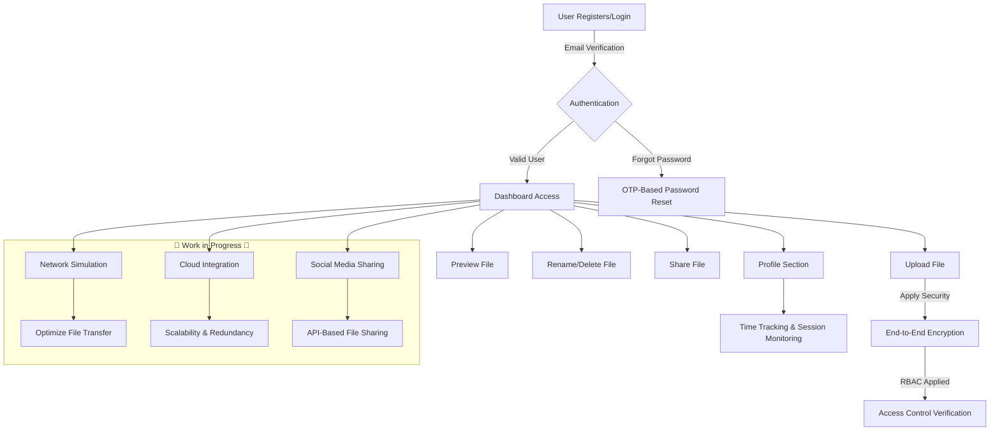

# 📁 Real-Time File Management System

<p align="center">
  
</p>


---

## 📚 Table of Contents

- [Overview](#-overview)
- [Features](#-features)
- [Workflow](#-workflow)
- [Tech Stack](#-tech-stack)
- [Installation & Setup](#-installation--setup)
- [API Endpoints](#-api-endpoints)
- [Future Enhancements](#-future-enhancements)
- [Contributing](#-contributing)
- [Show Your Support](#-show-your-support)
- [Contact](#-contact)
- [Live Demo & Screenshots](#-live-demo--screenshots)

---

## 🚀 Overview

A powerful **Real-Time File Management System** designed for efficient file handling, secure access control, and live synchronization, ensuring seamless collaboration.

---

## ✨ Features

- 📂 **Instant File Management** – Upload, modify, and delete files in real time with just a few clicks.
- 🔄 **Live Synchronization** – Experience immediate updates across all users for a seamless workflow.
- 🔒 **Secure Access** – Benefit from role-based authentication to keep your files safe.
- ☁️ **Cloud Storage Ready** – Enjoy secure file storage capabilities with easy access from anywhere.
- 🎛️ **Admin Dashboard** – Monitor and manage your system comprehensively with our intuitive dashboard.
- 📱 **Responsive UI** – Our UI is built with JavaScript, jQuery UI, Tailwind CSS & Bootstrap, ensuring it looks great on any device.
- ✉️ **OTP Email Verification** – Enhance security with OTP for user authentication.
- 👤 **Dynamic Profile Page** – View and manage all your details in one place, with a modern and user-friendly interface.
- 📊 **Analytics Dashboard** – Gain insights into file usage and system performance with detailed analytics.

---

## 🔄 Workflow


---

## 🏗 Tech Stack

<p align="center">
  
  
  
  
  
  
  
  
  
</p>

---

## 🛠 Installation & Setup

### Prerequisites

Ensure you have the following installed:
- PHP & MySQL
- A web server (e.g., Apache, Nginx)

### Steps

1. **Clone the repository**:  
   ```sh
   git clone https://github.com/hemantgowardipe/files_management_system.git
   ```
2. **Set up the backend**:  
   ```sh
   cd backend
   Configure database connection in `config.php`
   ```
3. **Set up the frontend**:  
   ```sh
   cd frontend
   Open `index.html` in a browser
   ```
4. **Start the backend server**:  
   ```sh
   php -S localhost:8000 -t backend
   ```

---

## 📡 API Endpoints

| Method  | Endpoint               | Description           |
|---------|------------------------|-----------------------|
| `POST`  | `/api/auth/register`   | Register a user       |
| `POST`  | `/api/auth/login`      | Authenticate user     |
| `GET`   | `/api/files`           | Fetch all files       |
| `POST`  | `/api/files/upload`    | Upload a file         |
| `DELETE`| `/api/files/{id}`      | Delete a file         |

---

## 🔮 Future Enhancements

- ☁ **Cloud Integration** – Advanced cloud computing features.  
- 🌐 **Network Simulation** – Enhanced system performance & scalability.  
- 🛡 **Advanced Security Features** – Enhanced security measures and encryption.

---

## 🤝 Contributing

🙌 Contributions are welcome! Follow these steps:
1. Fork the repository & create a new branch.
2. Commit your changes & push them.
3. Open a pull request.

---

## 🌟 Show Your Support

Give a ⭐ if you like this project!

---

## 📬 Contact

📧 Email: rajugowardipe0@gmail.com  
🐙 GitHub: [hemantgowardipe](https://github.com/hemantgowardipe)

---

## 🌐 Live Demo & Screenshots

<p align="center">
  
  
  
  
  
  
</p>

---

<p align="center">
  <pre>
  ████████████████████████████████████████████████████  ██╗  ██╗███████╗██╗     ██╗      ██████╗
  ████████████████████████████████████████████████████  ██║  ██║██╔════╝██║     ██║     ██╔═══██╗
  ████████████████████████████████`.        ╙█████████  ███████║█████╗  ██║     ██║     ██║   ██║
  █████████████████████████████▀  ¿▓▓▓▓▓▓▓▓▄/ "███████  ██╔══██║██╔══╝  ██║     ██║     ██║   ██║
  ███████████████████████████▀.  ▓▓▓▓▓▓▓▓▓▓▓▓   ▐█████  ██║  ██║███████╗███████╗███████╗╚██████╔╝▄█╗
  ███████████████████████████ `  ▓▓▓▓▓▓▓▓▓▓▓▓  ` █████  ╚═╝  ╚═╝╚══════╝╚══════╝╚══════╝ ╚═════╝ ╚═╝
  ███████████████████████████ `  ▓▓▓▓▓▓▓▓▓▓▓▓   ▄█████
  ▀██████████████████████████▌  ▀▀▓▓▓▓▓▓▓▌╓╖. ███████  ███╗   ██╗██╗ ██████╗███████╗  ████████╗ ██████╗
  █▄▀██████████████████████████▄ ╩╦╙▀▀▀▀▀ ╣`,████████  ████╗  ██║██║██╔════╝██╔════╝  ╚══██╔══╝██╔═══██╗
  ▄▀█▄╙█████████████████████▀▀▀▀█████▄▄ .... ,▄██████  ██╔██╗ ██║██║██║     █████╗       ██║   ██║   ██║
  ██▄▀█▄╙█████████████████▀  ╪╢%╦══~╓,└ ╚▒▒▒ ╙▀|,╓╓═╤H   ▀█  ██║╚██╗██║██║██║     ██╔══╝       ██║   ██║   ██║
  █▀▀▀-▀█▌▄▀█████████████   ║▒▒▒▒▒▒▒▒▒▒╢╦ ╘ -╣▒▒▒▒▒▒▒▒▒╢╕   ▀  ██║ ╚████║██║╚██████╗███████╗     ██║   ╚██████╔╝
  ██▄▀██└║▄▄▄████████████▄          ═╕╕╕╕╕═╕═══════       ▄▄▄▄  ╚═╝  ╚═══╝╚═╝ ╚═════╝╚══════╝     ╚═╝    ╚═════╝
  ████▄▀█▌║███  ████████▌         ╕   ╩▒▒▒▒▒▒▒▒▒Ñ          ███
  ███████▌Ö▓▌   ▀██████████`╔▒▒╣ █ ▒▒m   ╚▒╢▒▒▒╩ -╣▒ ▌ ▒▒▒ ████  ███╗   ███╗███████╗███████╗████████╗  ██╗   ██╗ ██████╗ ██╗   ██╗
  ████ -"" ∞╙,▀.╙▀███████╜ ▒▒▒ ▄█ Ñ   -   S.  ═▒▒▒▒ █ ║▒▒╕└███  ████╗ ████║██╔════╝██╔════╝╚══██╔══╝  ╚██╗ ██╔╝██╔═══██╗██║   ██║
  ████████▄ -«   ∞▄.▀",╓═     ╒██   ═╣▒▒ `Ñ╛        █▌ ▒▒▒ ███  ██╔████╔██║█████╗  █████╗     ██║      ╚████╔╝ ██║   ██║██║   ██║
  █████████▌ º     ╤╣▒╣╩^",▄▄███▀  ▒▒╣"     ''''''' ▀▀     `█  ██║╚██╔╝██║██╔══╝  ██╔══╝     ██║       ╚██╔╝  ██║   ██║██║   ██║
  █████████  ▌       ▄▄████████─         ---------    L'▒▒▒ ██  ██║ ╚═╝ ██║███████╗███████╗   ██║        ██║   ╚██████╔╝╚██████╔╝
  ▀▀▀▀▀▀▀▀▀▀▀▀▀-     ▀▀▀▀▀▀▀▀▀▀       '╧╧╧╧╧╧╧╧╧`     ╚ ╧╧╧- ▀  ╚═╝     ╚═╝╚══════╝╚══════╝   ╚═╝        ╚═╝    ╚═════╝  ╚═════╝
  </pre>
</p>
